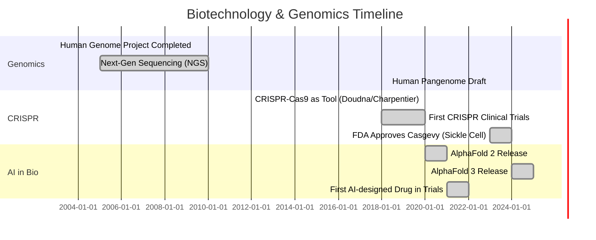

# Biotechnology & Computational Biology References

> A curated collection of resources for Biotechnology, Bioinformatics, Synthetic Biology, CRISPR, and AI in Drug Discovery.

---

## 📋 Table of Contents

- [Overview](#overview)
- [Bioinformatics & Computational Biology](#bioinformatics--computational-biology)
- [CRISPR & Gene Editing](#crispr--gene-editing)
- [Synthetic Biology](#synthetic-biology)
- [AI in Drug Discovery](#ai-in-drug-discovery)
- [GitHub Repositories](#github-repositories)
- [Datasets & Databases](#datasets--databases)
- [Educational Resources](#educational-resources)
- [Timeline & Milestones](#timeline--milestones)

---

## Overview

Biotechnology merges biology with technology to improve healthcare, agriculture, and industrial processes. This repository focuses on the computational and high-tech aspects, including genetic engineering, AI-driven drug design, and genomic data analysis.

---

## Bioinformatics & Computational Biology

### Tools & Libraries
- **[Biopython](https://biopython.org/):** Foundational Python library for biological computation.
- **[Bioconductor](https://www.bioconductor.org/):** R packages for analysis of high-throughput genomic data.
- **[GROMACS](https://www.gromacs.org/):** High-performance molecular dynamics simulator.
- **[RDKit](https://www.rdkit.org/):** Cheminformatics and machine learning for chemistry.
- **[Galaxy](https://usegalaxy.org/):** Web-based platform for accessible, reproducible biomedical research.

### Genomics Pipelines
- **GATK (Genome Analysis Toolkit):** Standard for variant discovery.
- **Nextflow:** Workflow system for scalable and reproducible pipelines.
- **DeepVariant:** Google's deep learning-based variant caller.

---

## CRISPR & Gene Editing

### Core Technologies
- **CRISPR-Cas9:** The revolutionary gene-editing tool derived from bacterial immune systems.
- **Prime Editing:** "Search-and-replace" genome editing without double-strand breaks.
- **Base Editing:** Precise conversion of one DNA letter to another.

### Resources
- **[Innovative Genomics Institute (IGI)](https://innovativegenomics.org/):** Founded by Jennifer Doudna, offers extensive educational guides.
- **[Synthego CRISPR 101](https://www.synthego.com/learn/crispr):** Comprehensive eBook and guides for beginners and experts.
- **[Addgene CRISPR Guide](https://www.addgene.org/guides/crispr/):** Repository for plasmids and practical lab protocols.

### Companies
- **CRISPR Therapeutics:** Developing gene-based medicines (e.g., for Sickle Cell Disease).
- **Intellia Therapeutics:** In vivo genome editing.
- **Editas Medicine:** Genome editing for ocular and blood diseases.

---

## Synthetic Biology

### Frameworks
- **Design-Build-Test-Learn (DBTL):** The engineering cycle for biological systems.
- **BioBricks:** Standardized DNA sequences for assembling biological circuits.

### Tools
- **[TinkerCell](http://www.tinkercell.com/):** CAD for synthetic biology.
- **[Benchling](https://www.benchling.com/):** Cloud-based platform for life science R&D (electronic lab notebook + molecular biology suite).

### Key Players
- **Ginkgo Bioworks:** "The Organism Company" - platform for cell programming.
- **Twist Bioscience:** High-throughput DNA synthesis on silicon.
- **Zymergen (Acquired by Ginkgo):** Biofacturing and materials.

---

## AI in Drug Discovery

### Deep Learning Models
- **[AlphaFold (DeepMind)](https://deepmind.google/technologies/alphafold/):** Solved the protein folding problem; predicts 3D structure from amino acid sequence.
- **[RoseTTAFold](https://www.bakerlab.org/index.php/2021/07/15/rosettafold/):** Protein structure prediction tool from the Baker Lab.
- **[DeepChem](https://deepchem.io/):** Open-source library for deep learning in drug discovery, materials science, and quantum chemistry.

### Leading Companies
- **Recursion Pharmaceuticals:** AI-driven decoding of biology to discover new medicines.
- **Insilico Medicine:** End-to-end AI for target discovery and generative chemistry.
- **Isomorphic Labs:** Alphabet company re-imagining drug discovery with AI (built on AlphaFold).
- **Exscientia:** First AI-designed drug to enter clinical trials.
- **Relay Therapeutics:** Combining computation with experimentation for protein motion.

---

## GitHub Repositories

### Top Projects
| Project | Description | Language |
|---------|-------------|----------|
| **[alphafold](https://github.com/google-deepmind/alphafold)** | Protein structure prediction system | Python |
| **[biopython](https://github.com/biopython/biopython)** | Tools for biological computation | Python |
| **[deepchem](https://github.com/deepchem/deepchem)** | Democratizing deep learning for science | Python |
| **[rdkit](https://github.com/rdkit/rdkit)** | Cheminformatics and machine learning | C++/Python |
| **[awesome-bioinformatics](https://github.com/danielecook/Awesome-Bioinformatics)** | Curated list of bioinformatics software | Markdown |
| **[nf-core](https://github.com/nf-core)** | Community effort for Nextflow pipelines | Nextflow |

---

## Datasets & Databases

- **[GenBank (NCBI)](https://www.ncbi.nlm.nih.gov/genbank/):** The NIH genetic sequence database.
- **[UniProt](https://www.uniprot.org/):** Comprehensive resource for protein sequence and functional information.
- **[PDB (Protein Data Bank)](https://www.rcsb.org/):** Archive of 3D structural data of biological macromolecules.
- **[Human Cell Atlas](https://www.humancellatlas.org/):** Mapping every cell type in the human body.
- **[ChEMBL](https://www.ebi.ac.uk/chembl/):** Database of bioactive drug-like small molecules.

---

## Educational Resources

### Courses
- **MIT OpenCourseWare:** "Computational Biology: Genomes, Networks, Evolution."
- **Coursera:** "Genomic Data Science Specialization" (Johns Hopkins).
- **Rosalind:** Platform for learning bioinformatics through problem-solving.

### YouTube Channels
- **[StatQuest with Josh Starmer](https://www.youtube.com/c/joshstarmer):** Brilliant explanations of statistics and ML in biology.
- **[iBiology](https://www.youtube.com/user/iBiology):** Talks by the world's leading biologists.
- **[OmicsLogic](https://www.youtube.com/c/PineBiotech):** Bioinformatics and data science training.

---

## Recent Research Feed
### 🆕 Latest q-bio Research (2026-02-01)
- **[Computational investigation of single herbal drugs in Ayurveda for diabetes and obesity using knowledge graph and network pharmacology](http://arxiv.org/abs/2601.21643v1)** (2026-01-29)
  > *Metabolic diseases such as type 2 diabetes and obesity represent a rapidly escalating global health burden, yet current therapeutic strategies largely target isolated symptoms or single molecular path...*
- **[Multiple binding modes of AKT on PIP$_3$-containing membranes](http://arxiv.org/abs/2601.21216v1)** (2026-01-29)
  > *The PI3K/AKT signaling pathway is triggered by recruitment of AKT to cellular membranes. Although AKT is a multidomain serine/threonine kinase composed of an N-terminal pleckstrin homology (PH) domain...*
- **[WFR-MFM: One-Step Inference for Dynamic Unbalanced Optimal Transport](http://arxiv.org/abs/2601.20606v1)** (2026-01-28)
  > *Reconstructing dynamical evolution from limited observations is a fundamental challenge in single-cell biology, where dynamic unbalanced optimal transport provides a principled framework for modeling ...*
- **[Control systems for synthetic biology and a case-study in cell fate reprogramming](http://arxiv.org/abs/2601.20135v1)** (2026-01-27)
  > *This paper gives an overview of the use of control systems engineering in synthetic biology, motivated by applications such as cell therapy and cell fate reprogramming for regenerative medicine. A ubi...*
- **[GenPairX: A Hardware-Algorithm Co-Designed Accelerator for Paired-End Read Mapping](http://arxiv.org/abs/2601.19384v1)** (2026-01-27)
  > *Genome sequencing has become a central focus in computational biology. A genome study typically begins with sequencing, which produces millions to billions of short DNA fragments known as reads. Read ...*


### 🆕 Latest q-bio Research (2026-01-05)
- **[Evolutionary and Structural Constraints Define a Mutation-Resistant Catalytic Core in E. coli Serine Hydroxy methyltransferase (SHMT)](http://arxiv.org/abs/2601.00769v1)** (2026-01-02)
  > *Serine hydroxymethyltransferase is an essential enzyme in the Escherichia coli folate pathway, yet it has not been adopted as an antibacterial target, unlike DHFR, DHPS, or thymidylate synthase. To in...*
- **[Quantifying the uncertainty of molecular dynamics simulations : Good-Turing statistics revisited](http://arxiv.org/abs/2601.00618v1)** (2026-01-02)
  > *We have previously shown that Good-Turing statistics can be applied to molecular dynamics trajectories to estimate the probability of observing completely new (thus far unobserved) biomolecular struct...*
- **[The thermodynamics of pressure activated assembly of supramolecules in isochoric and isobaric systems](http://arxiv.org/abs/2601.00599v1)** (2026-01-02)
  > *The efficacy of cryopreservation is constrained by the difficulty of achieving sufficiently high intracellular concentrations of cryoprotective solutes without inducing osmotic injury or chemical toxi...*
- **[The Physics of Causation](http://arxiv.org/abs/2601.00515v1)** (2026-01-02)
  > *Assembly theory (AT) introduces a concept of causation as a material property, constitutive of a metrology of evolution and selection. The physical scale for causation is quantified with the assembly ...*
- **[MethConvTransformer: A Deep Learning Framework for Cross-Tissue Alzheimer's Disease Detection](http://arxiv.org/abs/2601.00143v1)** (2026-01-01)
  > *Alzheimer's disease (AD) is a multifactorial neurodegenerative disorder characterized by progressive cognitive decline and widespread epigenetic dysregulation in the brain. DNA methylation, as a stabl...*


## Timeline & Milestones



---

## Creating Automation

This repository is equipped with an automated research feed that fetches the latest **Quantitative Biology** papers from arXiv.

**To run manually:**
```bash
python3 scripts/update_feed.py
```

---

**Last Updated**: January 2026
**Maintained by**: [@nbajpai-code](https://github.com/nbajpai-code)
